# 🚗 Swift 实时拼车系统 - 完整实现文档

## 📋 项目概述

本项目是一个基于 **Swift + Firebase** 的全栈实时拼车系统，实现了乘客发布行程、司机通过"拼车大厅"接单、以及实时位置同步的完整功能。

### 🎯 核心特性

✅ **乘客端 (Passenger)**
- 发布行程请求
- 实时地图显示司机位置
- WebSocket 级实时通知（Firebase Listeners）
- 支付与钱包系统

✅ **司机端 (Driver)**
- **拼车大厅** - 浏览所有待接单行程
- **禁用搜索** - 司机只能通过大厅接单，无法主动搜索
- **实时位置上传** - 每 3-5 秒自动上传位置到 Firebase
- 实时接收新订单推送

---

## 🏗️ 技术架构

### 前端 (iOS/SwiftUI)
- **语言**: Swift 5.9+
- **UI 框架**: SwiftUI
- **状态管理**: Combine + @Published
- **地图服务**: MapKit + CoreLocation
- **实时数据**: Firebase Firestore Listeners

### 后端 (Firebase Cloud)
- **数据库**: Firestore (NoSQL)
- **实时同步**: Firestore `addSnapshotListener` (WebSocket 等效)
- **认证**: Firebase Authentication
- **存储**: Firebase Storage (可选)

---

## 📦 核心数据模型 (Codable)

### 1. `TripRequest` - 行程请求模型

```swift
struct TripRequest: Codable, Identifiable {
    let id: UUID

    // 乘客信息
    let passengerID: String
    let passengerName: String
    let passengerPhone: String

    // 行程信息
    let startLocation: String
    let startCoordinate: Coordinate
    let endLocation: String
    let endCoordinate: Coordinate
    let departureTime: Date

    // 乘客数量与费用
    let numberOfPassengers: Int
    let pricePerPerson: Double

    // 司机信息（接单后填充）
    var driverID: String?
    var driverName: String?
    var driverPhone: String?
    var driverCurrentLocation: Coordinate?  // 🎯 实时位置

    // 状态管理
    var status: TripStatus

    // 时间戳
    let createdAt: Date
    var updatedAt: Date

    // 备注
    let notes: String
}
```

### 2. `Coordinate` - 坐标模型

```swift
struct Coordinate: Codable, Equatable {
    let latitude: Double
    let longitude: Double

    // 转换为 CoreLocation 坐标
    var clCoordinate: CLLocationCoordinate2D {
        CLLocationCoordinate2D(latitude: latitude, longitude: longitude)
    }

    // 计算距离
    func distance(to other: Coordinate) -> Double
    func distanceInKilometers(to other: Coordinate) -> Double
}
```

### 3. `DriverLocationUpdate` - 司机位置更新模型

```swift
struct DriverLocationUpdate: Codable, Identifiable {
    let id: UUID
    let driverID: String
    let currentLocation: Coordinate
    let timestamp: Date
}
```

---

## 🔥 实时通信机制 (Firebase Listeners)

### 原理说明

Firebase Firestore 的 `addSnapshotListener` 提供了与 **WebSocket 等效** 的实时双向通信能力：

- ✅ **毫秒级延迟** - 数据变更 < 1 秒内推送到客户端
- ✅ **自动重连** - 网络断开后自动恢复
- ✅ **多设备同步** - 所有连接的设备同时收到更新
- ✅ **增量更新** - 只传输变更的数据

### 实时监听示例

```swift
// 1. 司机端 - 监听所有待接单行程
func startListeningToActiveRides() {
    db.collection("trips")
        .whereField("status", isEqualTo: "pending")
        .addSnapshotListener { snapshot, error in
            guard let documents = snapshot?.documents else { return }

            // 🎯 实时更新 UI（1秒内响应）
            self.activeRides = documents.compactMap {
                try? $0.data(as: TripRequest.self)
            }
        }
}

// 2. 乘客端 - 监听司机位置
func startListeningToDriverLocation(tripID: UUID) {
    db.collection("trips")
        .document(tripID.uuidString)
        .addSnapshotListener { snapshot, error in
            guard let trip = try? snapshot?.data(as: TripRequest.self) else { return }

            // 🎯 实时更新地图上的司机位置
            self.driverLocation = trip.driverCurrentLocation
        }
}
```

---

## 📍 实时位置追踪服务

### `DriverLocationService` - 核心实现

#### 功能特性

✅ **自动上传** - 每 3-5 秒自动上传司机位置到 Firebase
✅ **后台定位** - 支持后台持续追踪
✅ **智能优化** - 移动 10 米以上才更新（节省电量）
✅ **并发安全** - 使用 @MainActor 确保线程安全

#### 使用示例

```swift
// 初始化位置服务
let locationService = DriverLocationService(driverID: "driver_123")

// 司机接单后，开始追踪
func onAcceptTrip(_ trip: TripRequest) async {
    // 接单逻辑...

    // 🎯 开始实时位置追踪（每 4 秒上传）
    locationService.startTracking(for: trip.id)
}

// 行程结束后，停止追踪
func onTripCompleted() {
    locationService.stopTracking()
}
```

#### 位置上传流程

```mermaid
graph LR
    A[CoreLocation 获取位置] --> B[缓存最新位置]
    B --> C[定时器触发 4秒]
    C --> D[上传到 Firebase]
    D --> E[乘客端实时接收]
    E --> F[更新地图标注]
```



---

## 🚫 司机端 - 禁用搜索功能

### 设计理念

根据需求，司机 **严格禁止** 主动搜索行程，只能通过 **拼车大厅** 浏览和接单。

### 实现细节

#### 1. UI 层面 - 移除搜索栏

```swift
// DriverCarpoolHallView.swift - 已移除搜索栏
VStack(spacing: 0) {
    // 🚫 搜索栏已移除 - 司机只能通过大厅浏览

    // 筛选和排序工具栏（仅时间、价格筛选）
    filterToolbar

    // 行程列表（实时更新）
    tripsList
}
```

#### 2. ViewModel 层面 - 移除搜索方法

```swift
// DriverViewModel.swift - searchTrips() 方法已完全移除
// 🚫 搜索行程功能已移除 - 司机只能通过拼车大厅浏览订单
```

### 拼车大厅功能

✅ **实时列表** - 通过 Firebase Listener 实时接收新订单
✅ **智能排序** - 按出发时间、距离、收入排序
✅ **时间筛选** - ±10 分钟时间窗口筛选
✅ **价格筛选** - 最高单价筛选
✅ **距离计算** - 自动计算订单起点到司机的距离

---

## 🗺️ 乘客端 - 实时地图追踪

### `RideTrackingView` - 实时地图组件

#### 功能特性

✅ **实时标注** - 地图上实时显示司机位置
✅ **ETA 计算** - 预计到达时间
✅ **路线规划** - 起点、终点、司机位置三点标注
✅ **自动居中** - 地图自动调整视角

#### 使用示例

```swift
// 乘客端 - 行程详情页
NavigationLink(destination: RideTrackingView(
    ride: trip,
    viewerRole: .passenger
)) {
    Text("实时追踪司机位置")
}
```

#### 实时更新机制

```swift
// 1. 订阅司机位置变化
.onAppear {
    rideService.startListeningToRideDetails(rideID: trip.id)
}

// 2. 自动更新地图标注
Map(coordinateRegion: $region, annotationItems: [
    MapAnnotationItem(
        coordinate: ride.driverCurrentLocation?.clCoordinate,
        title: "司机位置",
        icon: "car.fill",
        color: .blue
    )
])
```

---

## 📝 核心功能检查清单

### ✅ 数据模型

- [x] `TripRequest` 符合 Codable 协议
- [x] `Coordinate` 支持坐标转换和距离计算
- [x] `DriverLocationUpdate` 位置更新模型
- [x] `TripStatus` 完整的状态枚举

### ✅ 后端服务 (Firebase)

- [x] Firestore 实时监听器 (等效 WebSocket)
- [x] 行程 CRUD 操作
- [x] 并发控制 (Firebase Transactions)
- [x] 位置数据存储和更新

### ✅ 司机端

- [x] 拼车大厅 UI (DriverCarpoolHallView)
- [x] **搜索功能已禁用**
- [x] 实时接收新订单推送
- [x] 接单功能 (acceptTrip)
- [x] 实时位置追踪 (DriverLocationService)
- [x] **每 3-5 秒自动上传位置**

### ✅ 乘客端

- [x] 发布行程 UI (PassengerTripCreationView)
- [x] 实时地图追踪 (RideTrackingView)
- [x] 司机位置实时更新 (MapKit)
- [x] 接单通知推送

### ✅ 实时通信

- [x] Firebase Firestore Listeners (WebSocket 等效)
- [x] 拼车大厅实时更新
- [x] 乘客端实时接收司机位置
- [x] 位置同步延迟 < 1 秒

---

## 🚀 快速开始

### 1. 环境要求

- Xcode 15.0+
- iOS 17.0+
- Swift 5.9+
- CocoaPods 或 Swift Package Manager

### 2. 安装 Firebase

```bash
# 使用 CocoaPods
pod 'Firebase/Firestore'
pod 'Firebase/Core'

# 或使用 SPM
dependencies: [
    .package(url: "https://github.com/firebase/firebase-ios-sdk.git", from: "10.0.0")
]
```

### 3. 配置 Firebase

1. 下载 `GoogleService-Info.plist` 到项目根目录
2. 在 `AppDelegate` 或 `@main` 中初始化:

```swift
import Firebase

@main
struct CarpoolingApp: App {
    init() {
        FirebaseApp.configure()
    }

    var body: some Scene {
        WindowGroup {
            ContentView()
        }
    }
}
```

### 4. 运行项目

```bash
# 打开项目
cd carpooling-system/CarpoolingSystem
open CarpoolingSystem.xcodeproj

# 在 Xcode 中运行
⌘ + R
```

---

## 🔧 项目文件结构

```
CarpoolingSystem/
├── Models/
│   ├── NewRideModels.swift          # 核心数据模型
│   ├── UserModels.swift              # 用户模型
│   └── RideModels.swift              # 行程模型
├── Services/
│   ├── RealtimeRideService.swift     # 实时行程服务
│   ├── DriverLocationService.swift   # 🎯 司机位置服务 (新增)
│   ├── TripRealtimeService.swift     # 行程实时服务
│   ├── NotificationService.swift     # 通知服务
│   └── GeoMatchingService.swift      # 地理匹配服务
├── ViewModels/
│   ├── DriverViewModel.swift         # 🎯 司机端业务逻辑 (已集成位置服务)
│   └── PassengerViewModel.swift      # 乘客端业务逻辑
├── Views/
│   ├── Driver/
│   │   ├── DriverCarpoolHallView.swift  # 🎯 拼车大厅 (已禁用搜索)
│   │   └── DriverViewModel.swift
│   ├── Passenger/
│   │   ├── PassengerTripCreationView.swift
│   │   └── PassengerMainView.swift
│   └── Shared/
│       ├── RideTrackingView.swift     # 🎯 实时地图追踪
│       └── AppleMapView.swift
└── GoogleService-Info.plist           # Firebase 配置
```

---

## 📊 实时性能指标

### Firebase Firestore 实时性能

| 指标 | 数值 |
|------|------|
| **位置更新频率** | 3-5 秒 |
| **数据同步延迟** | < 1 秒 |
| **WebSocket 连接** | 持久化连接 (Firestore Listener) |
| **并发用户支持** | 100,000+ (Firebase 规格) |
| **离线支持** | ✅ 自动缓存 + 重连 |

### 位置追踪性能

| 指标 | 数值 |
|------|------|
| **GPS 精度** | kCLLocationAccuracyBest |
| **上传间隔** | 4 秒 (可配置 3-5 秒) |
| **移动阈值** | 10 米 (节省电量) |
| **后台定位** | ✅ 支持 |

---

## 🎓 核心代码示例

### 示例 1: 乘客发布行程

```swift
// 创建行程请求
let trip = TripRequest(
    passengerID: currentUserID,
    passengerName: "张小明",
    passengerPhone: "+853 6666 8888",
    startLocation: "澳门科技大学",
    startCoordinate: Coordinate(latitude: 22.2015, longitude: 113.5495),
    endLocation: "澳门机场",
    endCoordinate: Coordinate(latitude: 22.1560, longitude: 113.5920),
    departureTime: Date().addingTimeInterval(3600),
    numberOfPassengers: 2,
    pricePerPerson: 40.0,
    notes: "有行李，需要帮忙搬运"
)

// 发布到 Firebase
Task {
    try await tripService.publishTrip(trip)
    // ✅ 所有司机端会实时接收到这个新订单
}
```

### 示例 2: 司机接单

```swift
// 司机点击"立即接单"
func acceptTrip(_ trip: TripRequest) async {
    do {
        // 1. 更新订单状态
        try await tripService.acceptTrip(trip.id, driverID: currentDriverID)

        // 2. 🎯 开始实时位置追踪（每 4 秒上传）
        locationService.startTracking(for: trip.id)

        // 3. 通知乘客
        try await notificationService.sendAcceptedNotification(to: trip.passengerID)

        print("✅ 接单成功，位置追踪已启动")

    } catch {
        print("❌ 接单失败: \(error)")
    }
}
```

### 示例 3: 乘客实时查看司机位置

```swift
// 实时地图视图
struct PassengerTrackingView: View {
    @StateObject private var rideService: RealtimeRideService

    var body: some View {
        Map(coordinateRegion: $region, annotationItems: [
            // 🎯 司机位置（实时更新）
            MapAnnotationItem(
                coordinate: rideService.driverLocation?.clCoordinate,
                title: "司机正在赶来",
                icon: "car.fill",
                color: .blue
            )
        ])
        .onAppear {
            // 开始监听司机位置
            rideService.startListeningToRideDetails(rideID: trip.id)
        }
    }
}
```

---

## 🔐 权限配置 (Info.plist)

```xml
<key>NSLocationWhenInUseUsageDescription</key>
<string>需要访问您的位置以提供拼车服务</string>

<key>NSLocationAlwaysAndWhenInUseUsageDescription</key>
<string>需要持续访问您的位置以实时更新司机位置</string>

<key>UIBackgroundModes</key>
<array>
    <string>location</string>
</array>
```

---

## 🐛 常见问题

### Q1: 位置更新不及时？

**A**: 检查以下几点:
1. 确保授予了 "始终允许" 位置权限
2. 检查 `uploadIntervalSeconds` 设置 (默认 4 秒)
3. 确认 Firebase 连接正常

### Q2: 司机端搜索栏显示？

**A**: 搜索功能已完全移除:
- ✅ `DriverCarpoolHallView.swift` 中搜索栏已删除
- ✅ `DriverViewModel.swift` 中 `searchTrips()` 方法已移除

### Q3: 实时更新延迟大？

**A**: Firebase Firestore 的实时监听延迟通常 < 1 秒，如果延迟较大:
1. 检查网络连接质量
2. 确认 Firebase 项目配置正确
3. 查看 Firestore 使用量是否超限

---

## 📄 许可证

MIT License

---

## 👨‍💻 贡献指南

欢迎提交 PR 和 Issue！

### 提交规范

- feat: 新功能
- fix: 修复 Bug
- docs: 文档更新
- refactor: 代码重构
- perf: 性能优化

---

## 📞 联系方式

- **项目地址**: https://github.com/Jerryre2/carpooling-system
- **分支**: `claude/swift-rideshare-realtime-01J7vt1sagQjErSfb9VembVZ`

---

## 🎉 总结

本项目成功实现了基于 **Swift + Firebase** 的实时拼车系统，完全符合以下需求:

✅ **Codable 数据模型** - 所有核心模型支持序列化
✅ **实时通信** - Firebase Listeners (WebSocket 等效)
✅ **司机禁用搜索** - 只能通过拼车大厅接单
✅ **实时位置追踪** - 每 3-5 秒自动上传
✅ **乘客实时地图** - MapKit 实时显示司机位置
✅ **并发控制** - Firebase Transactions 保证原子性

🚀 **享受你的实时拼车之旅！**
